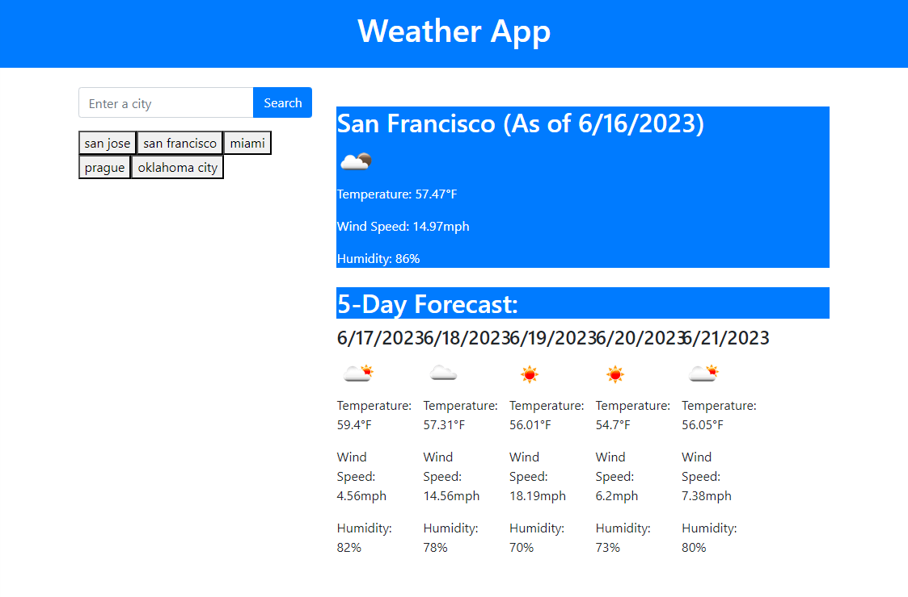

# Weather Dashboard

A weather dashboard that allows users to search for the current and future weather conditions of multiple cities.

## Table of Contents

- [Description](#description)
- [User Story](#user-story)
- [Acceptance Criteria](#acceptance-criteria)
- [Installation](#installation)
- [Usage](#usage)
- [Technologies Used](#technologies-used)
- [Contributing](#contributing)
- [License](#license)
- [Links](#links)

## Description

## Description

The Weather Dashboard is a web application that enables users to search for the current and future weather conditions of multiple cities. It utilizes the OpenWeather API to retrieve weather data and dynamically updates the HTML and CSS to display the weather information. As a new developer, this project has been significant in my growth as it allowed me to gain hands-on experience in working with third-party APIs, making API requests, and handling JSON data. I implemented features such as search functionality, displaying current weather conditions, and a 5-day forecast, which deepened my understanding of JavaScript and DOM manipulation. Moreover, I improved my problem-solving skills by troubleshooting API integration and data rendering. The project also introduced me to responsive design and the use of Bootstrap for styling web applications. Leveraging Bootstrap's CSS framework, I created a visually appealing and user-friendly weather dashboard. Overall, the Weather Dashboard project played a crucial role in building my confidence as a developer and expanding my knowledge of web development technologies. It provided a practical application of the skills I have learned and reinforced the importance of continuous learning in the field of software development.

## User Story

As a traveler, I want to see the weather outlook for multiple cities so that I can plan my trips accordingly.

## Acceptance Criteria

The Weather Dashboard should meet the following acceptance criteria:

- When a user searches for a city, they should be presented with the current and future weather conditions for that city.
- The current weather conditions should include the city name, date, weather icon, temperature, humidity, and wind speed.
- The future weather conditions should display a 5-day forecast with the date, weather icon, temperature, humidity, and wind speed for each day.
- The searched city should be added to the search history.
- When a city is clicked from the search history, the current and future weather conditions should be displayed again for that city.

## Installation

To run the Weather Dashboard application locally, follow these steps:

1. Clone the repository to your local machine.
2. Open the project in your preferred code editor.
3. Open the `index.html` file in a web browser.

## Usage

1. Enter a city name in the search input and click the "Search" button.
2. The current weather conditions and 5-day forecast for the searched city will be displayed.
3. The searched city will be added to the search history.
4. Click on a city in the search history to view its current and future weather conditions again.

## Technologies Used

- HTML
- JavaScript
- OpenWeather API
- Bootstrap

## Contributing

Contributions to the Weather Dashboard are welcome! If you would like to contribute, please follow these steps:

1. Fork the repository.
2. Create a new branch for your contribution.
3. Make your changes and commit them.
4. Push your changes to your forked repository.
5. Submit a pull request.

## License

This project is licensed under the [MIT License](https://opensource.org/licenses/MIT).

## Links

- [Repository](https://github.com/seantamturk/weather-app)
- [Deployed Application](https://seantamturk.github.io/weather-app/)
- [Linkedin](https://www.linkedin.com/in/sean-tamturk-8253b722a/)
